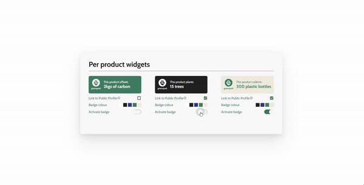

# Vue/TS Widget - Practice



 - Node: v18.18.2              
 - Stories folder structure is based on Emulsify    
 - Vue / Storybook setup is based on [this article from farcaller.](https://farcaller.medium.com/vue-storybook-typescript-starting-a-new-project-with-best-practices-in-mind-3fc7b3ceae4e)    
 - views/HomeView.vue is used for demonstration purposes to prove that the component is usable in a Vue project    


## Project setup
```
npm install
```

### Compiles and hot-reloads for development
```
npm run serve
```

### Compiles and minifies for production
```
npm run build
```

### Run your unit tests
```
npm run test:unit
```

### Run your end-to-end tests
```
npm run test:e2e
```

### Lints and fixes files
```
npm run lint
```

### Customize configuration
See [Configuration Reference](https://cli.vuejs.org/config/).


### Feedback
 - no http call - response is hard coded
 - responsiveness - when getting closer to mobile state the components columns don't behave as expected
 - scaleability not the best - when adding more components there is some issue
 - acessibility - I forgot to ask for details on this

